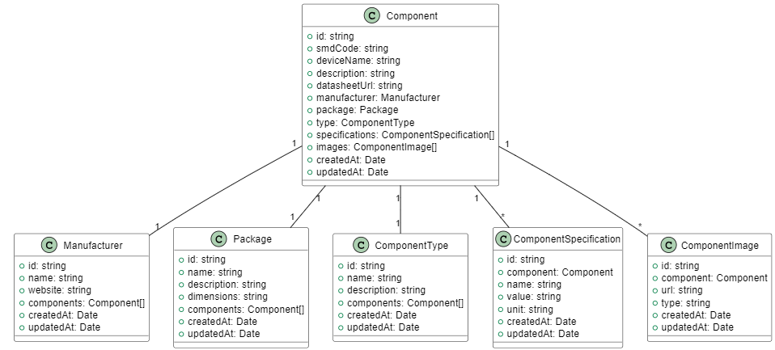
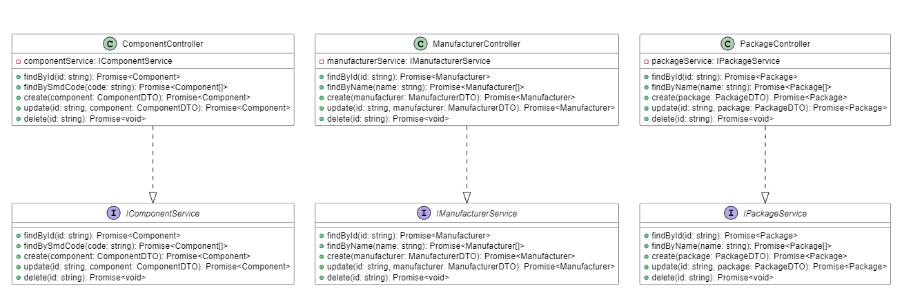
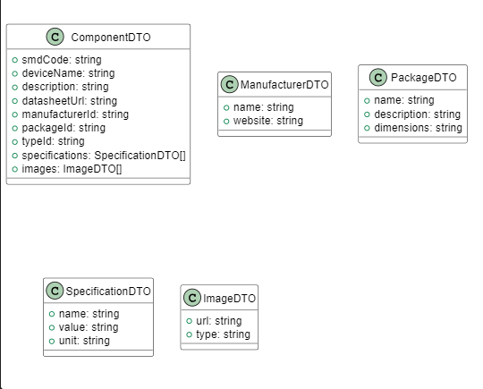
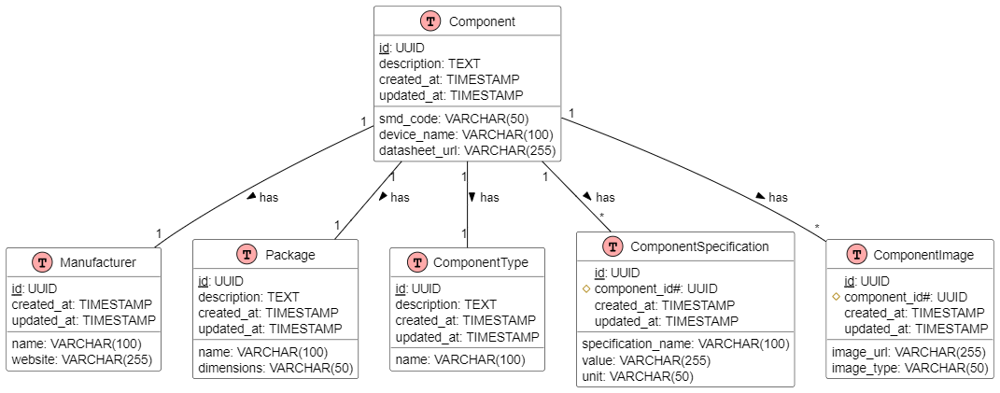
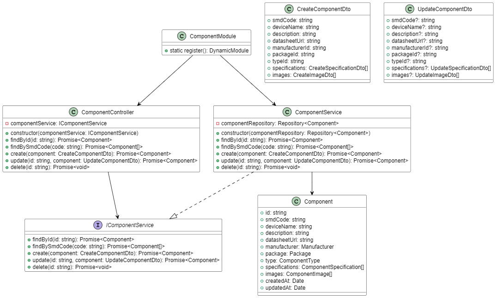

# Imagens da Documentação

Esta pasta contém as imagens geradas a partir dos diagramas PlantUML e outras imagens utilizadas na documentação.

## Diagramas de Arquitetura

### Diagrama de Classes
- `class-diagram-entities.png` - Diagrama mostrando as entidades principais do sistema
- `class-diagram-interfaces-controllers.png` - Diagrama das interfaces e controllers
- `class-diagram-dtos.png` - Diagrama dos DTOs (Data Transfer Objects)

### Diagrama do Banco de Dados
- `database.png` - Diagrama da estrutura do banco de dados

### Exemplo de Componente NestJS
- `nestjs-component-example.png` - Diagrama de exemplo de estrutura de componente usando NestJS

## Estrutura

- `architecture/` - Imagens dos diagramas de arquitetura
- `screenshots/` - Screenshots da aplicação
- `diagrams/` - Outros diagramas e ilustrações

## Convenções de Nomenclatura

Use o seguinte padrão para nomear as imagens:
- Diagramas de arquitetura: `architecture-<tipo>-<nome>.png`
- Screenshots: `screenshot-<feature>-<descrição>.png`
- Diagramas gerais: `diagram-<tipo>-<nome>.png`

## Formatos Suportados

- PNG (preferencial para diagramas)
- JPG (para screenshots)
- SVG (para diagramas vetoriais)

## Como Gerar Imagens

1. A partir dos arquivos PlantUML:
   ```bash
   plantuml ../architecture/*.puml -o ../images/architecture
   ```

2. Para screenshots:
   - Use ferramentas de captura de tela
   - Mantenha uma resolução consistente
   - Otimize as imagens para web

## Manutenção

- Mantenha as imagens atualizadas com o código
- Remova imagens obsoletas
- Documente a origem de cada imagem
- Verifique a qualidade antes de adicionar

## Visualização dos Diagramas

Para visualizar os diagramas em tamanho maior, clique nas imagens abaixo:

### Diagrama de Classes

*Diagrama mostrando as entidades principais do sistema*


*Diagrama das interfaces e controllers*


*Diagrama dos DTOs (Data Transfer Objects)*

### Diagrama do Banco de Dados

*Diagrama da estrutura do banco de dados*

### Exemplo de Componente NestJS

*Diagrama de exemplo de estrutura de componente usando NestJS* 